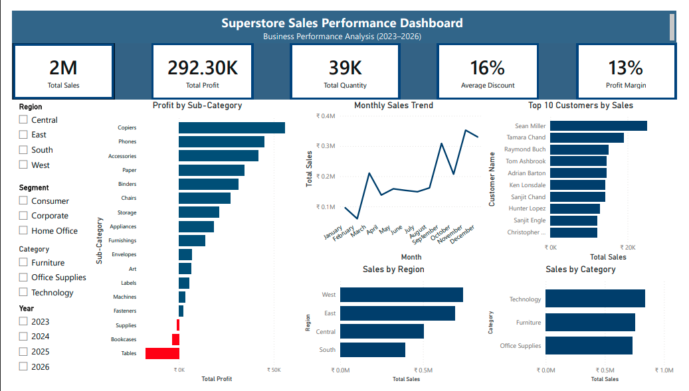

# 📊 Superstore Sales Performance Dashboard

An interactive Power BI dashboard built using the Superstore dataset to analyze sales performance, profitability, customer behavior, and regional trends.

---

## 📌 Project Objective

Transform raw sales data into meaningful business insights using interactive dashboards and DAX calculations.

---

## 🛠️ Tools & Technologies

- Power BI Desktop
- DAX
- Data Modeling
- Data Visualization

---

## 📈 Key Performance Indicators

- Total Sales
- Total Profit
- Total Quantity
- Average Discount
- Profit Margin

---

## 📊 Dashboard Features

- 📈 Monthly Sales Trend
- 💰 Profit by Sub-Category
- 🌍 Sales by Region
- 📦 Sales by Category
- 👥 Top 10 Customers by Sales
- 🎛 Interactive Slicers
  - Region
  - Segment
  - Category
  - Year

---

## 🧮 DAX Measures

- Total Sales
- Total Profit
- Total Quantity
- Average Discount
- Profit Margin
- Dynamic Profit Color

---

## 🔍 Key Insights

- Technology generated the highest sales.
- Copiers were the most profitable sub-category.
- Tables consistently generated losses.
- West region achieved the highest sales.
- Sales peaked during November.
- A small group of customers generated a significant share of revenue.

---

## 💡 Recommendations

- Continue investing in Technology.
- Investigate losses in the Tables sub-category.
- Apply successful sales strategies from the West region to other regions.
- Prepare inventory and marketing campaigns for November demand.
- Strengthen relationships with top customers.

---

## 📸 Dashboard Preview

  

---

## 📂 Files Included

- Superstore_Sales_Dashboard.pbix
- SampleSuperstore.csv
- Dashboard.png
- README.md

---

## 🎯 Skills Demonstrated

- Power BI
- DAX
- Dashboard Design
- Data Visualization
- Business Analysis
- KPI Development
- Interactive Reporting
- Data Storytelling

---

## 👤 Author

**Paritosh Prateek Choudhary**

- LinkedIn: https://www.linkedin.com/in/paritosh-prateek-choudhary-81a990267/
- GitHub: https://github.com/paritosh-choudhary
